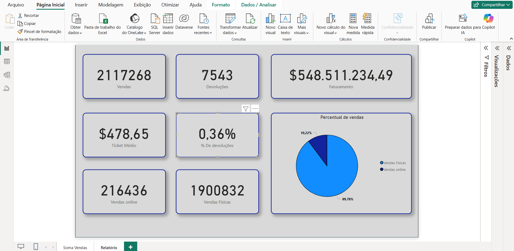
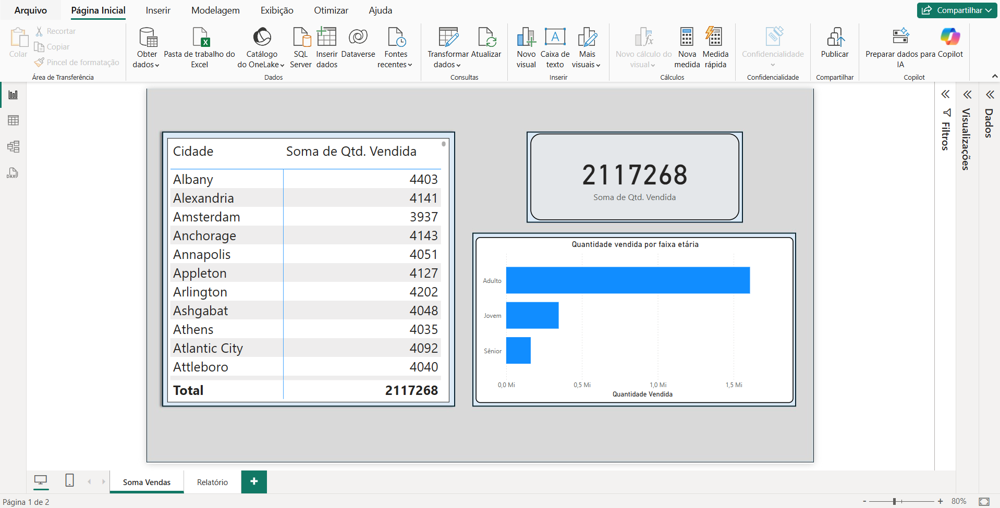

# Analise corporativa de vendas

Projeto de analise de vendas, visando destrinchar os números gerais, como: 
- Vendas por cidade.
- Vendas por loja física.
- Vendas por loja online.
- Venda por faixa etária.

### Visuais incluídos:
- Cartões
- Gráfico de barras
- Matriz

🖼️
🖼️

---

- 📊 Desenvolvido no Power BI Desktop  
